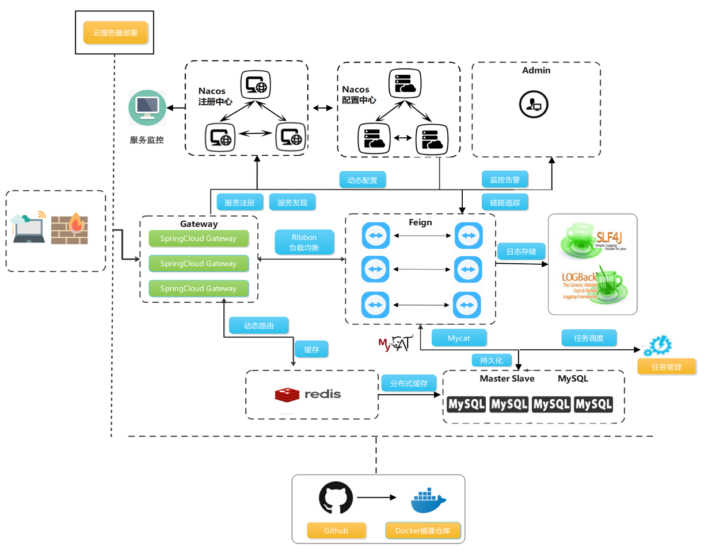
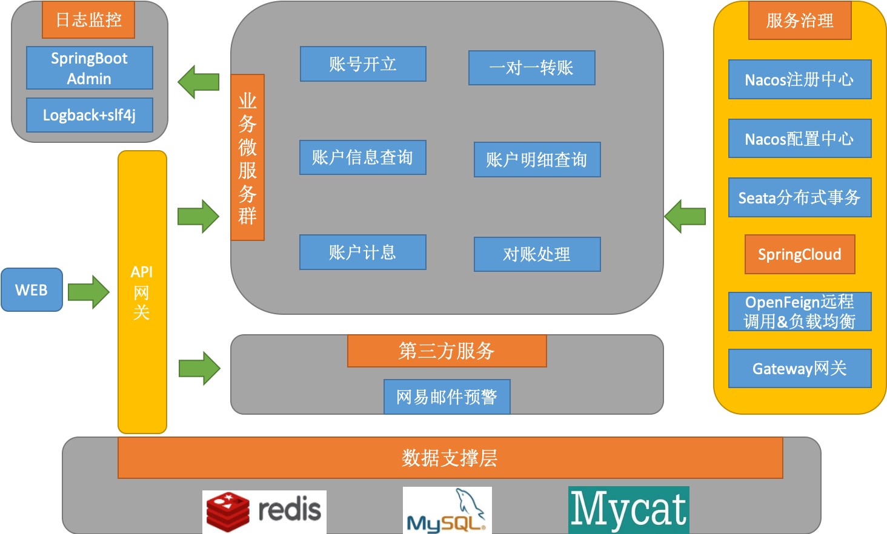
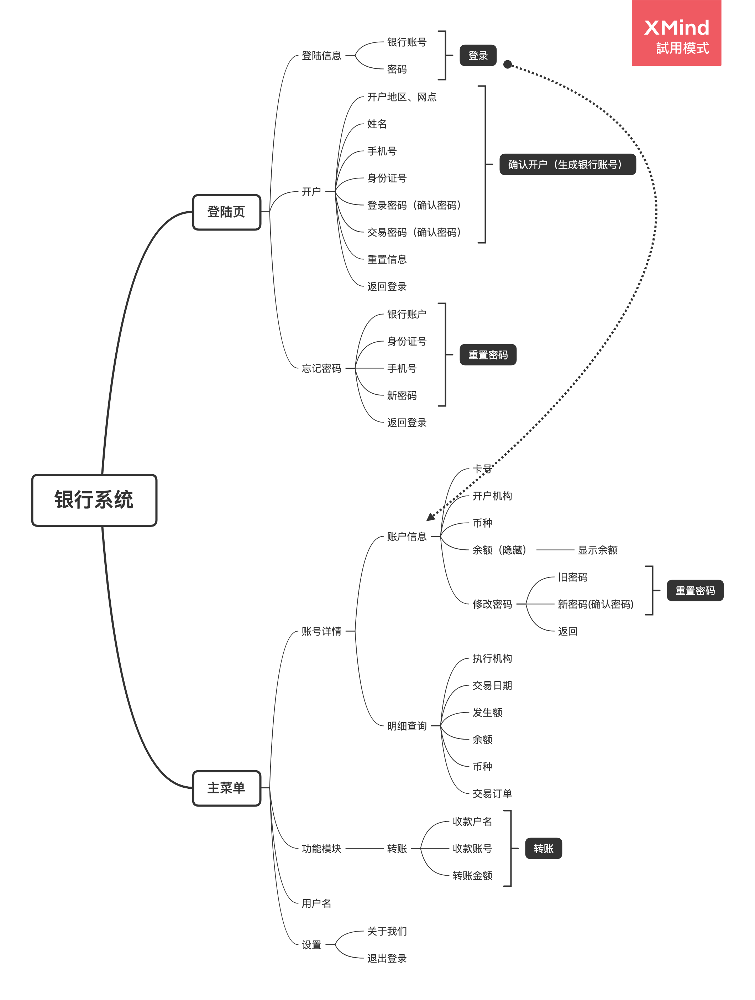
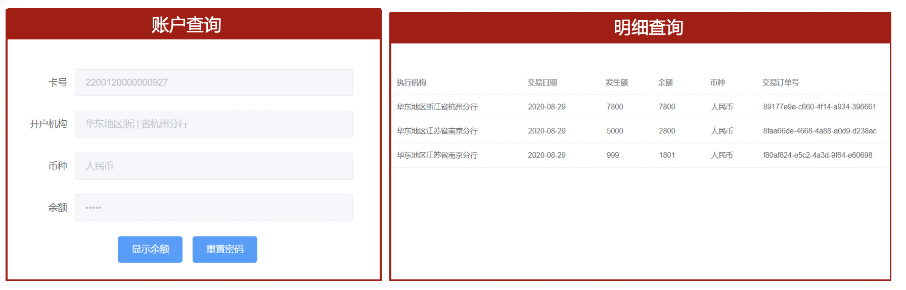

# 金融分布式系统

本系统包括账号开立、一对一转账、账户信息查询、账户明细查询、账户计息、对账处理这些业务，此外还引入了第三方网易邮件预警服务。

### 系统架构：

### 项目组成

### 前端页面构成：

### 部分功能截图
登陆页：

开户页：

账户查询及明细查询：

### [前端点这里](https://github.com/ZHUHAI-ICBC/Distributed-Systems/tree/master/%E5%89%8D%E7%AB%AF)

### [后端点这里](./后端)
